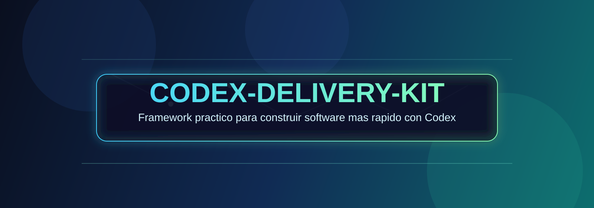
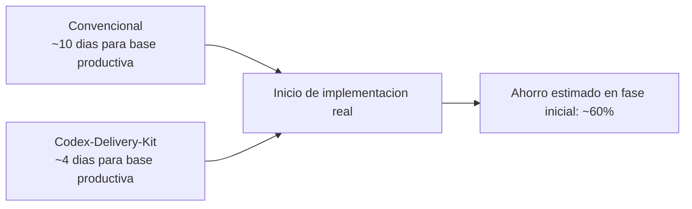

<p align="center">
  
</p>

<h1 align="center">Codex-Delivery-Kit</h1>

<p align="center">
  Kit open source para construir software con Codex de punta a punta:
  discovery, arquitectura, implementacion, QA, seguridad, despliegue y operacion.
</p>

<p align="center">
  <a href="https://www.linkedin.com/in/oscarmonroytellez/">
    
  </a>
  <a href="https://www.instagram.com/monroy.dev">
    
  </a>
</p>

## Vision

Codex-Delivery-Kit fue creado especialmente para la comunidad hispanohablante de desarrollo, con un enfoque practico:

- Menos tiempo configurando base tecnica.
- Mas tiempo entregando valor real de negocio.
- Flujo claro y repetible para trabajar con Codex de forma profesional.

## Por que usar este kit

| Area                    | Desarrollo convencional               | Con Codex-Delivery-Kit                 |
| ----------------------- | ------------------------------------- | -------------------------------------- |
| Setup inicial           | Manual, disperso y variable           | Guiado con comandos y plantillas       |
| Arquitectura base       | Se define desde cero en cada proyecto | Presets y stacks listos para arrancar  |
| QA y seguridad          | Se agrega tarde o de forma parcial    | Incluido desde baseline                |
| Estandares de trabajo   | Dependientes del equipo               | AGENTS + skills + checklist integrados |
| Tiempo para MVP tecnico | Alto                                  | Menor y mas predecible                 |

## Grafico de velocidad (referencial)

Comparativa estimada para llegar a una base productiva (no benchmark absoluto):

| Modelo             | Tiempo estimado fase inicial | Velocidad relativa |
| ------------------ | ---------------------------- | ------------------ |
| Convencional       | 10 dias                      | 1.0x               |
| Codex-Delivery-Kit | 4 dias                       | 2.5x               |

```text
Convencional         [##########] 10 dias
Codex-Delivery-Kit [####......]  4 dias
```



## Como funciona

El flujo recomendado dentro del repo es:

1. Discovery y requisitos.
2. Seleccion o confirmacion de stack.
3. Plan tecnico y de entrega.
4. Implementacion incremental.
5. Validacion (lint, tests, build, seguridad).
6. Release y operacion.

Todo el flujo esta alineado con `AGENTS.md`, `.codex/commands` y `.codex/skills`.

## Que incluye

| Categoria         | Opciones incluidas                                                                                                 |
| ----------------- | ------------------------------------------------------------------------------------------------------------------ |
| Presets           | `rapid`, `robust`                                                                                                  |
| Tipos de proyecto | `frontend`, `backend`, `fullstack`                                                                                 |
| Frontend          | `react-tailwind-vite`, `angular-tailwind-cli`                                                                      |
| Backend           | `fastify-prisma-postgres`, `nestjs-prisma-postgres`, `fastapi-postgres`, `go-gin-postgres`, `java-spring-postgres` |
| Cloud IaC         | `terraform-aws-base`, `terraform-gcp-base`, `terraform-azure-base`                                                 |
| Verticales        | `saas`, `ecommerce`, `marketplace`, `ai-heavy`                                                                     |

## Capacidades listas para usar

| Bloque                 | Incluido por defecto                                              |
| ---------------------- | ----------------------------------------------------------------- |
| Seguridad de acceso    | Auth + RBAC + refresh tokens (backends)                           |
| Dominio inicial        | Modulos base de pagos y mensajeria                                |
| Migraciones y seed     | Prisma, Alembic, SQL files, Flyway (segun stack)                  |
| Calidad                | Tests base + auth flow e2e en templates backend                   |
| Seguridad automatizada | `npm audit`, `pip-audit`, `govulncheck`, `OWASP dependency-check` |
| Entrega                | CI/CD con preview deploy de PR via GHCR                           |

## Sitio de demostración

Hay una aplicación web independiente que muestra cómo funciona el kit. Usa el mismo stack de frontend (React + Tailwind + Vite) y contiene toda la documentación en un formato agradable, con animaciones y navegación fácil.

Para arrancar la demo:

```bash
cd showcase
npm install
npm run dev    # abrirá http://localhost:5173
```

La carpeta `showcase/public/docs` ya incluye todos los archivos Markdown originales del repositorio; así puedes navegar la documentación desde la interfaz.

## Guia de uso paso a paso

### 1) Inicializar contexto

```bash
node scripts/init-context.js
```

Este paso prepara el contexto de proyecto para que Codex aplique reglas y convenciones correctas.

### 2) Scaffolding directo por template

```bash
node scripts/scaffold-webapp.js --template fastapi-postgres --target apps/api
```

Usalo cuando ya definiste el stack exacto.

### 3) Scaffolding por preset y tipo

```bash
node scripts/scaffold-webapp.js --preset robust --project-type fullstack --frontend react --backend-stack java --vertical saas --cloud aws --target apps/my-product
```

Usalo cuando quieres componer el proyecto por nivel de robustez, tipo de app y entorno cloud.

### 4) Verificar checklist y estructura

```bash
node scripts/verify-checklist.js
node scripts/verify-scaffold-templates.js
node scripts/verify-scaffold-templates.js --with-install
```

### 5) Levantar el portal de docs

```bash
cd docs-site
npm install
npm run docs:dev
```

## CI/CD del repositorio

| Workflow                                  | Objetivo                         |
| ----------------------------------------- | -------------------------------- |
| `.github/workflows/template-ci.yml`       | Validacion continua de templates |
| `.github/workflows/template-cicd.yml`     | Pipeline de build y despliegue   |
| `.github/workflows/template-security.yml` | Escaneos de seguridad            |
| `.github/workflows/docs-release.yml`      | Publicacion de documentacion     |

## Creditos

- Inspiracion tomada del Kit de Antigravity de vudovn: https://github.com/vudovn/antigravity-kit
- Esta version fue creada especialmente para Codex, con funcionalidades nuevas enfocadas tambien en la comunidad hispanohablante.
- Creado por: [Oscar Monroy T.](https://omonroyt.github.io/)
- LinkedIn: https://www.linkedin.com/in/oscarmonroytellez/
- Instagram: https://www.instagram.com/monroy.dev
